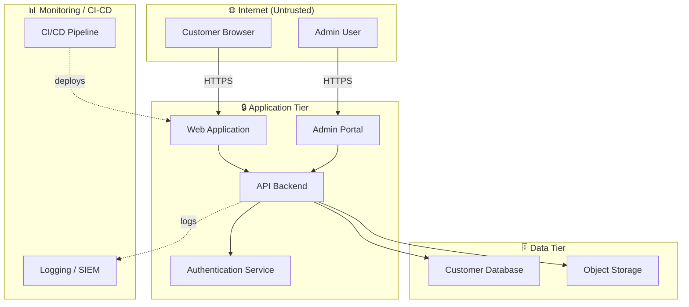
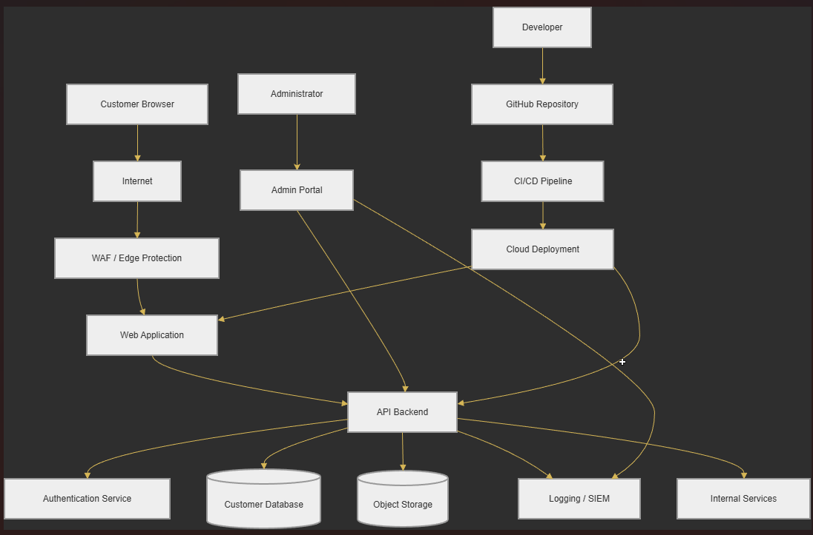
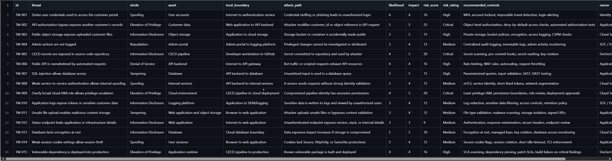
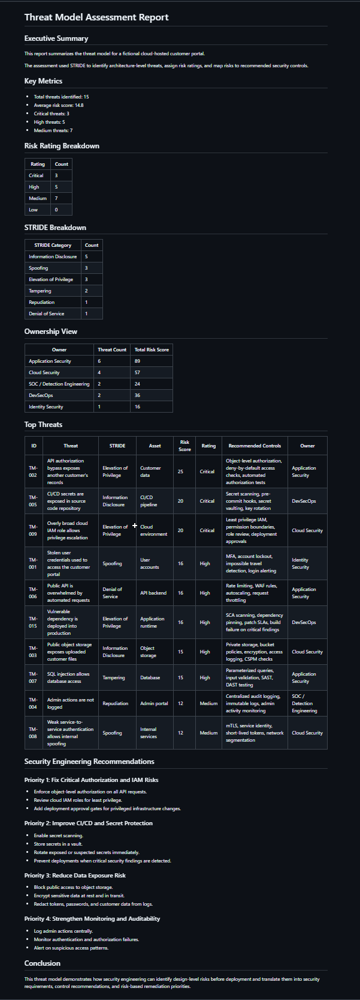
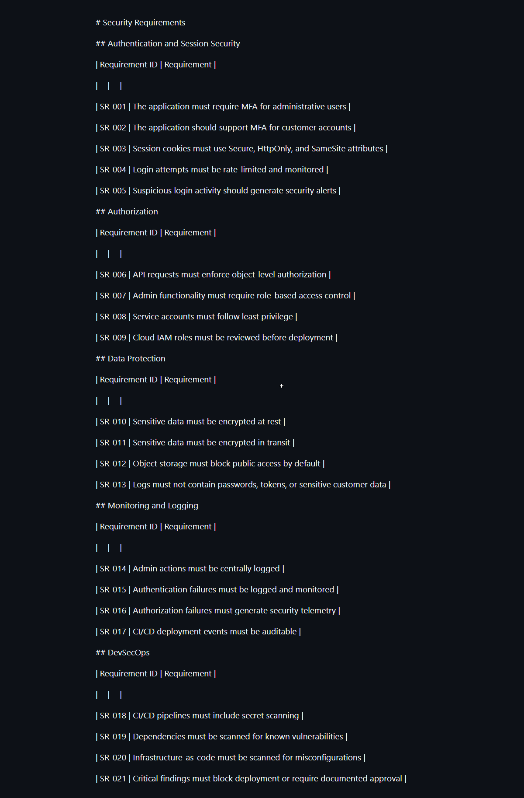

# 🧩 Threat Modeling Security Assessment

A STRIDE-based threat model and security-requirements assessment for a cloud-hosted customer portal — identifying threats, mapping trust boundaries, scoring risk, and tracing threats to controls.

> **TL;DR** — STRIDE analysis of a cloud customer portal: trust boundaries, data-flow analysis, a threat register, attack scenarios, prioritized security requirements, and threat-to-control mapping, output as an automated assessment report.

---

## 📌 Overview

This project demonstrates a threat modeling and security requirements assessment for a fictional cloud-hosted customer portal.

The assessment uses STRIDE to identify threats, document trust boundaries, score risk, map threats to security controls, and generate a professional threat model report.

---

## 🗺️ Scenario

The modeled application includes:

- Customer browser
- Web application
- API backend
- Authentication service
- Customer database
- Object storage
- Admin portal
- Logging/SIEM
- GitHub repository
- CI/CD pipeline
- Cloud deployment environment

---

## 🗺️ Data Flow & Trust Boundaries

Each boundary between subgraphs is a **trust boundary** where STRIDE threats are analyzed (e.g. spoofing at the Internet → Application edge, tampering/EoP at the Application → Data edge).

---

## 🧰 Tools Used

- STRIDE methodology
- Markdown
- CSV
- Python
- Mermaid diagrams
- GitHub

---

## 🧠 Skills Demonstrated

- Threat modeling
- Security architecture review
- Trust boundary identification
- Data flow analysis
- Application security risk analysis
- Cloud security risk analysis
- Risk scoring
- Security control mapping
- Security requirements definition
- Professional security reporting

---

## 📁 Project Structure

| Folder | Description |
|---|---|
| architecture | Data flow diagram and trust boundary documentation |
| threat-model | STRIDE analysis, attack scenarios, and threat register |
| controls | Security requirements and threat-to-control mapping |
| reports | Generated threat model assessment report |
| scripts | Python report generation script |
| notes | Methodology documentation |
| screenshots | Project evidence screenshots |

---

## 📦 Key Deliverables

- Data flow diagram
- Trust boundary analysis
- STRIDE threat analysis
- Threat register
- Attack scenarios
- Security requirements
- Threat-to-control mapping
- Automated assessment report

---

## 📸 Screenshots

### Data Flow Diagram

### Threat Register

### Threat Model Report

### Security Requirements

---

## 🔑 Security Takeaway

Threat modeling helps identify security risks before deployment. This project demonstrates how security engineering can turn architecture review into actionable security requirements, prioritized controls, and risk-based remediation planning.

---

*Author: Josh · Security Architecture portfolio project*
