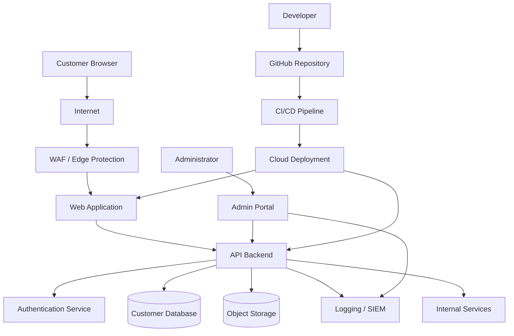

# Data Flow Diagram

## Scenario

This threat model is based on a fictional cloud-hosted customer portal.

The application allows customers to authenticate, view account data, upload files, and interact with backend APIs. Administrators use a separate admin portal for support and operational tasks. Developers deploy code through a CI/CD pipeline.

## Diagram

## Key Assets

| Asset | Description |
|---|---|
| User accounts | Customer identities and login sessions |
| Customer database | Sensitive customer records |
| Object storage | Uploaded files and customer documents |
| API backend | Business logic and data access layer |
| Admin portal | Privileged operational access |
| CI/CD pipeline | Deployment path into production |
| Logging/SIEM | Security and audit evidence |
| Cloud IAM | Permissions used by workloads and deployment systems |

## Trust Boundaries Highlighted

| Boundary | Description |
|---|---|
| Internet to WAF/Web App | Public traffic enters the application environment |
| Web App to API Backend | Frontend requests cross into backend business logic |
| API Backend to Database | Application accesses sensitive customer records |
| API Backend to Object Storage | Application reads and writes uploaded files |
| Admin Portal to API | Privileged users perform administrative actions |
| GitHub to CI/CD Pipeline | Source code enters the build and deployment process |
| CI/CD Pipeline to Cloud | Automated deployment modifies cloud resources |
| Application to Logging/SIEM | Application and admin activity generate security telemetry |